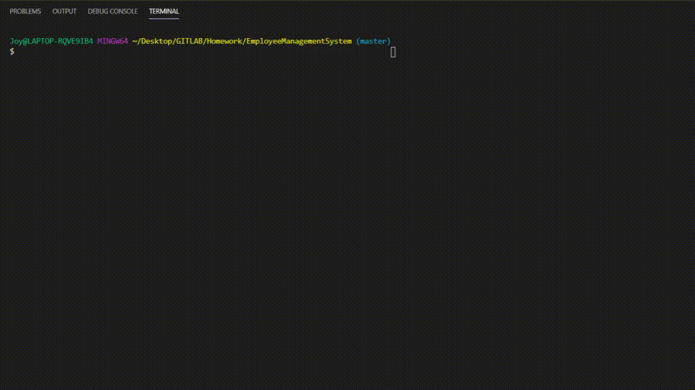

# Welcome to Employee Management Tracker

  
 
 

Every company needs a system to hold all of their employees. Within these systems, companies want to keep track of everyone's salaries, managers, roles, and departments they work for. This application will allow companies to add new employees, discard old ones, and update the employees that they already have. This application will also allow the user to create roles and departments should they need to. 

## User Story

As a user, I want to be able to create employee profiles, update them, and remove them as needed, so that I can have an up-to-date collection of records for my company. 

  
## Table of Contents
* [Installation](#installation)
* [Usage](#usage)
* [License](#license)
* [Demo](#demo)
* [Questions](#questions)

## Installation

To use this application, run the following commands in your terminal to install the appropriate packages if you are not using the webbased application

    npm i 

Be sure that you have downloaded Inquirer, MySQL, and console.table. 

## Usage 

After you've installed the packages, you need to create the database for your company's employees. There is a basic database in the databases folder as well as a seed.sql file for examples. After you have successfully created your databases, please ensure that you have a running connection. 

Then all you need to do is open up your terminal and run 
    node server.js

## Future Developments

As you can see, there are many additional features that can be added. This application is constantly being updated and as of May 11th, 2020, I am working on creating features that allow you to remove departments, remove roles, update managers, and view employees by managers so please keep checking my application for updates. 

## Demo

## Questions
  
If you see any improvements that can be made, please email me at joychen5069@gmail.com. You can also visit my GitHub page at https://github.com/joychen5069 or visit the GitHub page at https://github.com/joychen5069/EmployeeManagementSystem
